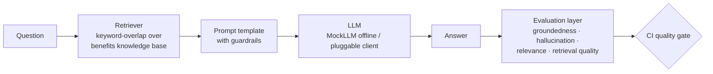

# GenAI Quality Lab

[](https://github.com/IshanGaikwad/GenAI-Quality-Lab/actions/workflows/eval.yml)
[](https://github.com/IshanGaikwad/GenAI-Quality-Lab/actions/workflows/eval.yml)

**A working demonstration of how to test a RAG-based GenAI assistant** — retrieval quality, groundedness, hallucination detection, and prompt regression, wired into CI as a quality gate.

Built by [Ishan Gaikwad](https://www.linkedin.com/in/ishan-gaikwad-7124927a/) — AI Quality Engineering Lead. This repo demonstrates, on public tools and an original toy system, the evaluation techniques I use.

```
✅ Runs fully offline — no API keys, no cost, deterministic results
✅ pytest evaluation suite + Robot Framework smoke suite
✅ 100% line coverage, enforced in CI (build fails below 100%)
✅ CI quality gate via GitHub Actions
✅ Optional Langfuse tracing hooks (no-op unless configured)
```

## Why this exists

Traditional QA asks *"does the feature work?"* For LLM systems the harder questions are:

| Question | Metric family | Where in this repo |
|---|---|---|
| Did the retriever surface the right documents? | Retrieval precision/recall | `tests/test_retrieval_quality.py` |
| Is every claim in the answer supported by the retrieved context? | Groundedness | `tests/test_groundedness.py` |
| Which specific claims are fabricated? | Hallucination detection | `tests/test_hallucination.py` |
| Does the answer actually address the question? | Answer relevance | `tests/test_groundedness.py` |
| Did someone silently edit the system prompt? | Prompt regression | `tests/test_prompt_regression.py` |
| Does the bot refuse instead of improvising when it doesn't know? | Refusal contract | both suites |

## Architecture



The system under test is a deliberately small RAG chatbot (`app/`): a keyword-overlap retriever over an employee-benefits knowledge base, a guardrailed prompt template, and a deterministic `MockLLM`. Small on purpose — **the evaluation layer is the point**, and a mock LLM makes the whole suite free, fast, and reproducible in CI.

## The part most eval demos skip: testing the tests

`MockLLM(hallucinate=True)` deliberately appends a fabricated claim to otherwise-correct answers. The suite uses it to prove the hallucination detector:

- **catches the seeded fabrication** (true-positive test), and
- **doesn't flag grounded answers** (false-positive test), and
- `test_mean_groundedness_can_mask_hallucinations` documents *why claim-level detection is the gate rather than the mean score*: an answer with two grounded claims and one fabricated one still averages ~0.79 groundedness. Aggregate scores hide point failures.

A detector that has never seen a failure is itself untested.

## Run it

```bash
pip install -r requirements.txt

# Evaluation suite
pytest -v

# ...with coverage, exactly as CI enforces it (fails below 100%)
pytest --cov=app --cov=evals --cov-report=term-missing --cov-fail-under=100

# Robot Framework smoke suite (business-readable layer)
robot --pythonpath . --outputdir robot-results robot/
```

Both suites also run on every push via `.github/workflows/eval.yml`. The
pytest step runs under coverage with `--cov-fail-under=100`, so the eval
layer (`app/`, `evals/`) stays fully exercised — including the
degenerate-input guards in `tests/test_degenerate_inputs.py` — and any
uncovered line turns the build red.

## Design decisions

**Deterministic lexical metrics gate CI; LLM-as-judge runs elsewhere.** The metrics here (`evals/metrics.py`) are transparent lexical implementations of the same metric families used by Arize Phoenix, Langfuse, DeepEval, and Ragas. They are free, fast, and reproducible — exactly what a *blocking* CI gate needs. Semantic metrics (embeddings, NLI, LLM-as-judge) add depth but are heavier and introduce nondeterminism; in a production pipeline they belong in a separate, non-blocking evaluation stage. This repo implements **both** — the lexical blocking gate here, and the semantic stage (`semantic_eval/`) described below.

**Coverage is gated at 100%, but coverage is a floor, not the goal.** CI runs pytest under `--cov-fail-under=100`, so any line in `app/` or `evals/` that no test exercises turns the build red. On a deliberately small eval core this is cheap to hold and it forces the degenerate-input branches — empty answers, stopword-only questions, empty retrieval — to be tested rather than assumed, which is exactly where lexical metrics silently misbehave. The honest caveat: 100% line coverage proves every line *ran*, not that every line is *correct* — the behavioral assertions and the seeded-hallucination tests do that work. Coverage keeps the untested-branch count at zero; it is not a substitute for meaningful tests.

**The prompt is tested like production config.** A reworded guardrail changes model behavior exactly like an untested code change. `test_prompt_regression.py` pins the guardrail clauses, the fallback string, and the context-before-question structure, so any prompt edit fails CI and forces deliberate review.

**Retrieval and generation are evaluated separately.** Most "hallucinations" in RAG systems are retrieval failures — the model never saw the right document. Splitting the layers localizes the fault.

**Retrieval has a relevance floor, not just a "does it overlap" check.** A document must share at least `MIN_RELEVANCE` (40%) of the query's content tokens to be retrieved. Without it, a single incidental word — "company" appears in nearly every benefits doc — was enough to pull unrelated documents, which let the bot answer out-of-scope questions and pad correct answers with grounded-but-off-topic sentences. The floor was added after running the assistant end-to-end surfaced exactly those two failures; the fix ships with retrieval-layer regression tests (`test_retrieval_quality.py`) that pin all three behaviors. The honest caveat: `0.4` is tuned to this corpus — it sits in the gap between incidental overlap (~0.25–0.33) and genuine matches (≥0.5), and should be revisited as the knowledge base grows. This is also why tokenization is treated as product code: `401(k)` and `401k` must collapse to one token, or a user typing the shorthand silently retrieves nothing.

**Retrieval is scored by rank, not just presence.** Precision/recall over retrieved-id *sets* can't distinguish "the right document ranked first" from "ranked last." `reciprocal_rank` (→ MRR) and `hit_at_k` add rank-awareness: every in-scope golden case must place its expected document at rank 1 (`RR == 1.0`), a strict tripwire on ranking regressions. The retriever currently ranks perfectly, so this metric earns its keep as a regression guard rather than a current-defect finder — which is why its unit tests, not the golden set, prove it actually discriminates rank position.

**Answers are graded for correctness, not just groundedness.** Groundedness asks "is it supported by the context?" and `must_mention` asks "is this fact present?" — neither asks "does it match a known-good answer?" SQuAD-style token `answer_f1` against a curated `reference_answer` does, and it immediately caught what the others miss: the extractive system **over-answers**, appending a grounded-but-off-topic second sentence. Four in-scope answers score F1 0.50–0.69 for exactly that reason while groundedness and `must_mention` wave them through; the `F1 ≥ 0.5` floor is the regression trip. (Because `answer_f1` is lexical, it under-credits paraphrase — the semantic stage covers that side.)

**The refusal is an exact-string contract.** For out-of-scope questions the bot must return one pinned fallback string. Exact-matching it keeps refusal behavior testable and prevents "helpful" improvisation from creeping in.

**Two suite styles on one eval core.** The pytest suite is the engineering-depth layer; the Robot Framework suite (`robot/`) expresses the same checks in business-readable keywords — the layer stakeholders and manual QA can review. Both call the same `evals/metrics.py`.

## Semantic eval: catching what lexical overlap can't

The lexical metrics above have a correctness ceiling — they measure word overlap, not meaning:

- A **negated claim** ("PTO *cannot* be carried over") shares nearly every token with its source, so lexical groundedness rates it **0.89 and does not flag it** — a false negative.
- A **faithful paraphrase** shares few tokens, so it is wrongly flagged as a hallucination — a false positive.

[`semantic_eval/`](semantic_eval/) closes that gap with real models, and is the **separate, non-blocking stage** the blocking-gate decision above defers to:

- an **NLI cross-encoder** for entailment-based groundedness that catches **contradiction** — the negated claim above is labelled `contradiction`, and
- a **bi-encoder** for semantic relevance that credits **paraphrase** — a PTO answer to a "vacation" question scores ~0.40, where lexical relevance scores 0.00.

It deliberately lives outside `evals/` and the 100%-coverage gate: it needs `torch` and downloaded models — the opposite of what a *blocking* gate should be. Its own [workflow](.github/workflows/semantic-eval.yml) reports rather than gates, so the required lexical gate stays fast, offline, and deterministic. Run it with `python -m semantic_eval.run` (details in [`semantic_eval/README.md`](semantic_eval/README.md)). Honest caveat: NLI groundedness is conservative — correct extractive answers often land on `neutral`, so the reliable signal is *contradiction detection*, not the entailment fraction.

## Optional: observability

`observability/tracing.py` exports each interaction as a scored trace (retrieval span, generation span, eval scores attached) **if** Langfuse credentials are configured — and is a silent no-op otherwise. The suite never depends on a network service.

## Extending this

- Swap `MockLLM` for a real client (any object with `generate(prompt) -> str`) behind an env flag; keep the mock as the CI default.
- Deepen the semantic stage (`semantic_eval/`) — add DeepEval `GEval`/faithfulness, Ragas, or an LLM judge alongside the NLI + embedding metrics already there.
- Grow `evals/datasets/golden_set.json` — adversarial and hard-negative cases are in; add multilingual and multi-hop questions next.
- Trend scores over time in Langfuse/Phoenix instead of pass/fail only.

## License

MIT
