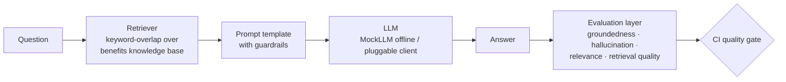

# GenAI Quality Lab

[](https://github.com/IshanGaikwad/GenAI-Quality-Lab/actions/workflows/eval.yml)

**A working demonstration of how to test a RAG-based GenAI assistant** — retrieval quality, groundedness, hallucination detection, and prompt regression, wired into CI as a quality gate.

Built by [Ishan Gaikwad](https://www.linkedin.com/in/ishan-gaikwad-7124927a/) — AI Quality Engineering Lead. This repo demonstrates, on public tools and an original toy system, the evaluation techniques I use.

```
✅ Runs fully offline — no API keys, no cost, deterministic results
✅ pytest evaluation suite + Robot Framework smoke suite
✅ CI quality gate via GitHub Actions
✅ Optional Langfuse tracing hooks (no-op unless configured)
```

## Why this exists

Traditional QA asks *"does the feature work?"* For LLM systems the harder questions are:

| Question | Metric family | Where in this repo |
|---|---|---|
| Did the retriever surface the right documents? | Retrieval precision/recall | `tests/test_retrieval_quality.py` |
| Is every claim in the answer supported by the retrieved context? | Groundedness | `tests/test_groundedness.py` |
| Which specific claims are fabricated? | Hallucination detection | `tests/test_hallucination.py` |
| Does the answer actually address the question? | Answer relevance | `tests/test_groundedness.py` |
| Did someone silently edit the system prompt? | Prompt regression | `tests/test_prompt_regression.py` |
| Does the bot refuse instead of improvising when it doesn't know? | Refusal contract | both suites |

## Architecture



The system under test is a deliberately small RAG chatbot (`app/`): a keyword-overlap retriever over an employee-benefits knowledge base, a guardrailed prompt template, and a deterministic `MockLLM`. Small on purpose — **the evaluation layer is the point**, and a mock LLM makes the whole suite free, fast, and reproducible in CI.

## The part most eval demos skip: testing the tests

`MockLLM(hallucinate=True)` deliberately appends a fabricated claim to otherwise-correct answers. The suite uses it to prove the hallucination detector:

- **catches the seeded fabrication** (true-positive test), and
- **doesn't flag grounded answers** (false-positive test), and
- `test_mean_groundedness_can_mask_hallucinations` documents *why claim-level detection is the gate rather than the mean score*: an answer with two grounded claims and one fabricated one still averages ~0.79 groundedness. Aggregate scores hide point failures.

A detector that has never seen a failure is itself untested.

## Run it

```bash
pip install -r requirements.txt

# Evaluation suite
pytest -v

# Robot Framework smoke suite (business-readable layer)
robot --pythonpath . --outputdir robot-results robot/
```

Both suites also run on every push via `.github/workflows/eval.yml`.

## Design decisions

**Deterministic lexical metrics gate CI; LLM-as-judge runs elsewhere.** The metrics here (`evals/metrics.py`) are transparent lexical implementations of the same metric families used by Arize Phoenix, Langfuse, DeepEval, and Ragas. They are free, fast, and reproducible — exactly what a *blocking* CI gate needs. LLM-as-judge metrics add semantic depth but cost money and introduce nondeterminism; in a production pipeline they belong in a separate, non-blocking evaluation stage. This repo models the blocking gate.

**The prompt is tested like production config.** A reworded guardrail changes model behavior exactly like an untested code change. `test_prompt_regression.py` pins the guardrail clauses, the fallback string, and the context-before-question structure, so any prompt edit fails CI and forces deliberate review.

**Retrieval and generation are evaluated separately.** Most "hallucinations" in RAG systems are retrieval failures — the model never saw the right document. Splitting the layers localizes the fault.

**The refusal is an exact-string contract.** For out-of-scope questions the bot must return one pinned fallback string. Exact-matching it keeps refusal behavior testable and prevents "helpful" improvisation from creeping in.

**Two suite styles on one eval core.** The pytest suite is the engineering-depth layer; the Robot Framework suite (`robot/`) expresses the same checks in business-readable keywords — the layer stakeholders and manual QA can review. Both call the same `evals/metrics.py`.

## Optional: observability

`observability/tracing.py` exports each interaction as a scored trace (retrieval span, generation span, eval scores attached) **if** Langfuse credentials are configured — and is a silent no-op otherwise. The suite never depends on a network service.

## Extending this

- Swap `MockLLM` for a real client (any object with `generate(prompt) -> str`) behind an env flag; keep the mock as the CI default.
- Add semantic metrics (DeepEval `GEval`/faithfulness, Ragas) as a non-blocking second stage.
- Grow `evals/datasets/golden_set.json` — adversarial phrasings, multilingual cases, boundary questions.
- Trend scores over time in Langfuse/Phoenix instead of pass/fail only.

## License

MIT
