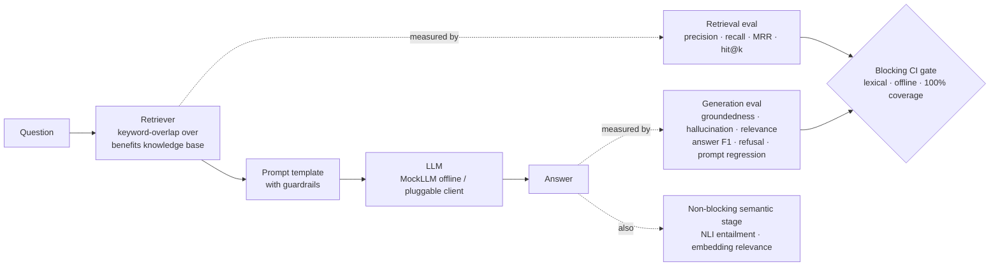

# GenAI Quality Lab

[](https://github.com/IshanGaikwad/GenAI-Quality-Lab/actions/workflows/eval.yml)
[](https://github.com/IshanGaikwad/GenAI-Quality-Lab/actions/workflows/eval.yml)
[](https://codespaces.new/IshanGaikwad/GenAI-Quality-Lab)
[](LICENSE)

> **In plain English:** AI assistants can sound confident and still make things up. This project is the automated safety net that catches that — a worked example of how you *quality-test* an AI system, not just build one. It ships a small assistant that answers employee-benefits questions like *"How much vacation do I get?"* from policy documents, then checks every answer: did it find the right document, is each claim backed by that document, did it invent anything, and does it admit when it doesn't know?

**A working demonstration of how to test a RAG-based GenAI assistant** — retrieval quality, groundedness, hallucination detection, and prompt regression, wired into CI as a quality gate.

An open-source, offline demonstration of how to evaluate a RAG-based GenAI assistant, built on public tools and an original toy system. Maintained by [Ishan Gaikwad](https://github.com/IshanGaikwad); contributions welcome.

```
✅ Runs fully offline — no API keys, no cost, deterministic results
✅ pytest evaluation suite + Robot Framework smoke suite
✅ 100% line coverage, enforced in CI (build fails below 100%)
✅ CI quality gate via GitHub Actions
✅ Separate semantic eval stage (embeddings + NLI) — non-blocking
✅ Optional observability: scored traces via a pluggable sink (no-op by default)
```

## Contents

- [Why this exists](#why-this-exists)
- [Who this is for](#who-this-is-for)
- [Architecture](#architecture)
- [Project structure](#project-structure)
- [Testing the tests](#the-part-most-eval-demos-skip-testing-the-tests)
- [Run it](#run-it)
- [Demo](#demo)
- [Design decisions](#design-decisions)
- [Semantic eval stage](#semantic-eval-catching-what-lexical-overlap-cant)
- [Optional: observability](#optional-observability)
- [Extending this](#extending-this)
- [Contributing](#contributing)
- [License](#license)

## Why this exists

Traditional QA asks *"does the feature work?"* For LLM systems the harder questions are:

| Question | Metric family | Where in this repo |
|---|---|---|
| Did the retriever surface the right documents? | Retrieval precision/recall | `tests/test_retrieval_quality.py` |
| Is the *right* document ranked first, not just present? | Retrieval ranking (MRR / hit@k) | `tests/test_retrieval_quality.py` |
| Is every claim in the answer supported by the retrieved context? | Groundedness | `tests/test_groundedness.py` |
| Which specific claims are fabricated? | Hallucination detection | `tests/test_hallucination.py` |
| Does the answer actually address the question? | Answer relevance | `tests/test_groundedness.py` |
| Does the answer match a known-good reference? | Answer correctness (token F1) | `tests/test_correctness.py` |
| Did someone silently edit the system prompt? | Prompt regression | `tests/test_prompt_regression.py` |
| Does the bot refuse instead of improvising when it doesn't know? | Refusal contract | both suites |

## Who this is for

- **Engineers, SDETs, and QA folks new to LLM/RAG testing** — a concrete, offline blueprint you can read in one sitting and run in seconds to watch groundedness, hallucination, retrieval, and prompt-regression checks actually fire.
- **Teams building a RAG assistant** who need an evaluation pattern to adopt — a working shape for a fast blocking CI gate *plus* a separate semantic stage.
- **Educators and learners** who want a small, honest, runnable reference for what "testing an AI" really looks like in code, past the buzzwords.

**What it's *not*:** a production chatbot, a library to install, or a finished product. The assistant itself is a deliberately tiny, offline stand-in — the whole point is the evaluation layer wrapped around it.

## Architecture



The system under test is a deliberately small RAG chatbot (`app/`): a keyword-overlap retriever over an employee-benefits knowledge base, a guardrailed prompt template, and a deterministic `MockLLM`. Small on purpose — **the evaluation layer is the point**, and a mock LLM makes the whole suite free, fast, and reproducible in CI.

## Project structure

```text
GenAI-Quality-Lab/
├── app/                       # The system under test — a deliberately tiny RAG chatbot
│   ├── knowledge_base.py      #   keyword-overlap retriever over an in-memory benefits corpus
│   └── chatbot.py             #   prompt template, guardrails, and a deterministic MockLLM
│
├── evals/                     # The evaluation core — lexical, offline, the point of the repo
│   ├── metrics.py             #   groundedness · hallucination · relevance · retrieval · F1 · MRR/hit@k
│   └── datasets/
│       └── golden_set.json    #   labelled cases: in-scope, off-topic, hard-negative, adversarial
│
├── tests/                     # The blocking gate — one pytest suite per metric family
│   ├── test_retrieval_quality.py   # retrieval recall + rank-aware metrics
│   ├── test_groundedness.py        # groundedness, must-mention facts, refusal contract
│   ├── test_hallucination.py       # seeded-failure tests (proves the detector works)
│   ├── test_correctness.py         # reference-answer token F1
│   ├── test_prompt_regression.py   # pins the prompt like production config
│   └── test_degenerate_inputs.py   # empty / stopword-only edge cases
│
├── robot/                     # Business-readable smoke suite (Robot Framework, same eval core)
│
├── semantic_eval/             # Separate NON-blocking stage — embeddings + NLI (needs torch)
│   ├── metrics.py             #   bi-encoder relevance + NLI entailment/contradiction
│   ├── run.py                 #   scores the golden set, writes report.json
│   └── requirements.txt       #   torch + models, isolated from the gate
│
├── observability/tracing.py   # Optional scored-trace export via a sink (no-op by default)
│
├── scripts/
│   └── make_social_preview.py # regenerates docs/social-preview.png (Pillow)
│
├── docs/social-preview.png    # GitHub social-preview card (upload via Settings)
│
├── cosmic-ray.toml            # Mutation-testing config (targets evals/metrics.py)
│
├── .github/workflows/
│   ├── eval.yml               # AI Quality Gate — fast, offline, required
│   ├── semantic-eval.yml      # Semantic Eval — heavy, non-blocking, reports only
│   └── mutation.yml           # Mutation Testing — non-blocking, "tests the tests"
│
└── requirements.txt           # Gate deps only: pytest + Robot Framework (no ML libraries)
```

## The part most eval demos skip: testing the tests

`MockLLM(hallucinate=True)` deliberately appends a fabricated claim to otherwise-correct answers. The suite uses it to prove the hallucination detector:

- **catches the seeded fabrication** (true-positive test), and
- **doesn't flag grounded answers** (false-positive test), and
- `test_mean_groundedness_can_mask_hallucinations` documents *why claim-level detection is the gate rather than the mean score*: an answer with two grounded claims and one fabricated one still averages ~0.79 groundedness. Aggregate scores hide point failures.

A detector that has never seen a failure is itself untested.

## Run it

**What "using it" means, in plain English:** this isn't an app you log into — it's a quality harness you *run*. You install it, run one command, and watch the automated checks on the demo assistant pass. All you need is Python 3.11+ — no API keys, no accounts, nothing to configure — and it finishes in a few seconds, fully offline.

```bash
# 1. Get the code
git clone https://github.com/IshanGaikwad/GenAI-Quality-Lab.git
cd GenAI-Quality-Lab

# 2. Install (just pytest + Robot Framework)
pip install -r requirements.txt

# 3. Run the checks — expect "78 passed, 2 xfailed"
pytest -v
```

**A green result means every check passed:** the assistant retrieved the right documents, kept its answers grounded in them, refused when it had no answer, and nothing regressed. The `2 xfailed` are *known* weaknesses tracked on purpose (see [Design decisions](#design-decisions)) — not surprises.

More ways to run it:

```bash
# The exact coverage gate CI enforces (the build fails below 100%)
pytest --cov=app --cov=evals --cov=observability --cov-report=term-missing --cov-fail-under=100

# The business-readable Robot Framework smoke suite
robot --pythonpath . --outputdir robot-results robot/
```

Both suites also run automatically on every push via `.github/workflows/eval.yml`, so you don't have to remember — a bad change turns the build red before it merges. The heavier **semantic stage is separate and optional** (it needs `torch` and downloaded models); see [its section below](#semantic-eval-catching-what-lexical-overlap-cant).

## Demo

There's no UI to screenshot — the "demo" of an evaluation harness is watching its checks pass. Here's an actual run:

```console
$ pip install -r requirements.txt
$ pytest --cov=app --cov=evals --cov=observability --cov-report=term-missing

tests/test_correctness.py .............                     [ 15%]
tests/test_degenerate_inputs.py ......                      [ 22%]
tests/test_groundedness.py ...........................xx..  [ 59%]
tests/test_hallucination.py ...                             [ 63%]
tests/test_observability.py ....                            [ 67%]
tests/test_prompt_regression.py ....                        [ 72%]
tests/test_retrieval_quality.py .......................     [100%]

Name                       Stmts   Miss  Cover
----------------------------------------------
app/chatbot.py                51      0   100%
app/knowledge_base.py         28      0   100%
evals/metrics.py              70      0   100%
observability/tracing.py      15      0   100%
----------------------------------------------
TOTAL                        164      0   100%

======== 82 passed, 2 xfailed in 0.18s ========
```

Every dot is a check that passed. The two `x`s are the *known* weaknesses tracked on purpose (see [Design decisions](#design-decisions)) — not failures. Want to try it without installing anything? Hit the **Open in GitHub Codespaces** badge at the top: it launches this repo in a browser-based environment where you can run the commands above with zero local setup.

## Design decisions

**Deterministic lexical metrics gate CI; LLM-as-judge runs elsewhere.** The metrics here (`evals/metrics.py`) are transparent lexical implementations of the same metric families used by Arize Phoenix, Langfuse, DeepEval, and Ragas. They are free, fast, and reproducible — exactly what a *blocking* CI gate needs. Semantic metrics (embeddings, NLI, LLM-as-judge) add depth but are heavier and introduce nondeterminism; in a production pipeline they belong in a separate, non-blocking evaluation stage. This repo implements **both** — the lexical blocking gate here, and the semantic stage (`semantic_eval/`) described below.

**Coverage is gated at 100%, but coverage is a floor, not the goal.** CI runs pytest under `--cov-fail-under=100`, so any line in `app/` or `evals/` that no test exercises turns the build red. On a deliberately small eval core this is cheap to hold and it forces the degenerate-input branches — empty answers, stopword-only questions, empty retrieval — to be tested rather than assumed, which is exactly where lexical metrics silently misbehave. The honest caveat: 100% line coverage proves every line *ran*, not that every line is *correct* — the behavioral assertions and the seeded-hallucination tests do that work. Coverage keeps the untested-branch count at zero; it is not a substitute for meaningful tests.

**Mutation testing proves the tests catch bugs, not just cover lines.** This is the systematic version of the caveat above. 100% coverage guarantees every line *runs* under test; it does not guarantee a test would *fail* if the line were wrong. The non-blocking [Mutation Testing workflow](.github/workflows/mutation.yml) closes that gap: `cosmic-ray` rewrites `evals/metrics.py` one small change at a time (a `/` becomes `^`, a `<` becomes `<=`) and checks the suite kills each mutant. A surviving mutant is a line the tests cover but don't actually verify — a concrete, actionable "write a better assertion here." It found real gaps: the first run left **35 of 269 mutants surviving** because the metric tests asserted *thresholds* (`>= 0.8`) and only exercised the formulas where precision equalled recall, so operator swaps that are no-ops at symmetric inputs slipped through. Adding exact-value assertions on asymmetric inputs (`tests/test_metric_arithmetic.py`) killed 26 of them, taking the score to **~96.6% (9 surviving)**. The remaining survivors are equivalent mutants — e.g. in `if not pred or not ref`, swapping `or`→`and` still returns `0.0` via the next guard, so no input distinguishes it. Chasing 100% there means contrived tests, so this is the deliberate stopping point. It runs separately because it rewrites files in place and takes minutes: the opposite of a fast blocking gate.

**The prompt is tested like production config.** A reworded guardrail changes model behavior exactly like an untested code change. `test_prompt_regression.py` pins the guardrail clauses, the fallback string, and the context-before-question structure, so any prompt edit fails CI and forces deliberate review.

**Retrieval and generation are evaluated separately.** Most "hallucinations" in RAG systems are retrieval failures — the model never saw the right document. Splitting the layers localizes the fault.

**Retrieval has a relevance floor, not just a "does it overlap" check.** A document must share at least `MIN_RELEVANCE` (40%) of the query's content tokens to be retrieved. Without it, a single incidental word — "company" appears in nearly every benefits doc — was enough to pull unrelated documents, which let the bot answer out-of-scope questions and pad correct answers with grounded-but-off-topic sentences. The floor was added after running the assistant end-to-end surfaced exactly those two failures; the fix ships with retrieval-layer regression tests (`test_retrieval_quality.py`) that pin all three behaviors. The honest caveat: `0.4` is tuned to this corpus — it sits in the gap between incidental overlap (~0.25–0.33) and genuine matches (≥0.5), and should be revisited as the knowledge base grows. This is also why tokenization is treated as product code: `401(k)` and `401k` must collapse to one token, or a user typing the shorthand silently retrieves nothing.

**Retrieval is scored by rank, not just presence.** Precision/recall over retrieved-id *sets* can't distinguish "the right document ranked first" from "ranked last." `reciprocal_rank` (→ MRR) and `hit_at_k` add rank-awareness: every in-scope golden case must place its expected document at rank 1 (`RR == 1.0`), a strict tripwire on ranking regressions. The retriever currently ranks perfectly, so this metric earns its keep as a regression guard rather than a current-defect finder — which is why its unit tests, not the golden set, prove it actually discriminates rank position.

**Answers are graded for correctness, not just groundedness.** Groundedness asks "is it supported by the context?" and `must_mention` asks "is this fact present?" — neither asks "does it match a known-good answer?" SQuAD-style token `answer_f1` against a curated `reference_answer` does, and it immediately caught what the others miss: the extractive system **over-answers**, appending a grounded-but-off-topic second sentence. Four in-scope answers score F1 0.50–0.69 for exactly that reason while groundedness and `must_mention` wave them through; the `F1 ≥ 0.5` floor is the regression trip. (Because `answer_f1` is lexical, it under-credits paraphrase — the semantic stage covers that side.)

**The refusal is an exact-string contract.** For out-of-scope questions the bot must return one pinned fallback string. Exact-matching it keeps refusal behavior testable and prevents "helpful" improvisation from creeping in.

**Adversarial and hard-negative cases probe the edges — and known failures are tracked, not hidden.** Beyond in-scope questions, the golden set includes *hard negatives* (near-domain but unanswerable — "PTO payout on termination", "is the Basic plan free?") and *adversarial* prompts (instruction injection, false premises), all of which must trigger refusal. Two hard negatives the current lexical system fails — it answers "do part-time employees accrue PTO?" with the *full-time* policy — are asserted with `strict` xfail: the test states the *correct* expectation, stays green today, and flips red the moment the system is fixed, forcing the marker's removal. This is why `pytest` reports `2 xfailed`: the gaps are visible and version-controlled, not swept under the rug.

**Two suite styles on one eval core.** The pytest suite is the engineering-depth layer; the Robot Framework suite (`robot/`) expresses the same checks in business-readable keywords — the layer stakeholders and manual QA can review. Both call the same `evals/metrics.py`.

## Semantic eval: catching what lexical overlap can't

The lexical metrics above have a correctness ceiling — they measure word overlap, not meaning:

- A **negated claim** ("PTO *cannot* be carried over") shares nearly every token with its source, so lexical groundedness rates it **0.89 and does not flag it** — a false negative.
- A **faithful paraphrase** shares few tokens, so it is wrongly flagged as a hallucination — a false positive.

[`semantic_eval/`](semantic_eval/) closes that gap with real models, and is the **separate, non-blocking stage** the blocking-gate decision above defers to:

- an **NLI cross-encoder** for entailment-based groundedness that catches **contradiction** — the negated claim above is labelled `contradiction`, and
- a **bi-encoder** for semantic relevance that credits **paraphrase** — a PTO answer to a "vacation" question scores ~0.40, where lexical relevance scores 0.00.

It deliberately lives outside `evals/` and the 100%-coverage gate: it needs `torch` and downloaded models — the opposite of what a *blocking* gate should be. Its own [workflow](.github/workflows/semantic-eval.yml) reports rather than gates, so the required lexical gate stays fast, offline, and deterministic. Run it with `python -m semantic_eval.run` (details in [`semantic_eval/README.md`](semantic_eval/README.md)). Honest caveat: NLI groundedness is conservative — correct extractive answers often land on `neutral`, so the reliable signal is *contradiction detection*, not the entailment fraction.

## Optional: observability

`observability/tracing.py` scores every interaction with the same metrics the gate uses and builds a serializable trace (retrieval span, generation span, eval scores attached). It is **SDK-agnostic**: pass a `sink` to export the trace anywhere; with no sink it is a pure offline no-op, so the suite never touches the network.

```python
from observability.tracing import traced_ask

def sink(trace):        # wire your backend here — Langfuse, Arize Phoenix, your own store
    ...                 # trace = {name, input, output, spans, scores}

response, scores = traced_ask(bot, "How many PTO days do I get?", sink=sink)
```

The module itself is tested and inside the 100% coverage gate; the backend adapter is yours to wire, so no specific (and version-churning) SDK is baked into the repo.

## Extending this

- Swap `MockLLM` for a real client (any object with `generate(prompt) -> str`) behind an env flag; keep the mock as the CI default.
- Deepen the semantic stage (`semantic_eval/`) — add DeepEval `GEval`/faithfulness, Ragas, or an LLM judge alongside the NLI + embedding metrics already there.
- Grow `evals/datasets/golden_set.json` — adversarial and hard-negative cases are in; add multilingual and multi-hop questions next.
- Trend scores over time in Langfuse/Phoenix instead of pass/fail only.

## Contributing

This is an open-source demonstration repo — intentionally small and opinionated — and issues, suggestions, and focused PRs are welcome. A few conventions keep contributions consistent with the rest:

- **Keep the gate green.** `pytest --cov=app --cov=evals --cov=observability --cov-fail-under=100` must pass — every line in `app/`, `evals/`, and `observability/` stays covered and no test may regress. New behavior comes with tests.
- **New metrics ship with tests and a rationale.** Add the metric to `evals/metrics.py`, cover every branch, and gate it on the golden set with a *documented* threshold, not a magic number.
- **Golden-set additions follow the `type` schema** (`in_scope` / `off_topic` / `hard_negative` / `adversarial`). If a case exposes a real weakness the system can't yet meet, mark it `xfail` with a reason rather than weakening a threshold.
- **Keep the blocking gate fast and offline.** Anything needing `torch`, model downloads, or network access belongs in the separate `semantic_eval/` stage — never in `app/`, `evals/`, or the root `requirements.txt`.
- **Match the house style:** transparent, readable metric implementations, and document honest caveats rather than hiding them.
- **Commit messages** use conventional prefixes (`feat:`, `fix:`, `test:`, `docs:`, `chore:`).

Before opening a PR, run the full local check:

```bash
pytest --cov=app --cov=evals --cov=observability --cov-report=term-missing --cov-fail-under=100
robot --pythonpath . --outputdir robot-results robot/
```

**Regenerating the social preview:** the repo's GitHub social-preview card (`docs/social-preview.png`) is generated by [`scripts/make_social_preview.py`](scripts/make_social_preview.py) — edit the text or colors there, then:

```bash
pip install pillow
python scripts/make_social_preview.py
```

GitHub has no API for the social preview, so upload the regenerated image manually via **Settings → General → Social preview**.

## License

MIT
